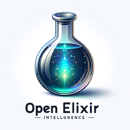

# FluffyTrain

## TL;DR

## Portal with Two Applications, Powered by OpenAI GPT-4

  
  

### OpenEI (aka Open Elixir Intelligence)

- **Purpose**:
  - Generates a working example of Elixir code.
- **Flow**:
  - Receives a request from the user to generate a working code example.
  - Validates the code at runtime using `Code.eval_string`.
  - Fixes any errors post-validation until the correct solution is received.
- **Demo**:
  - Type in the input form: "How to reverse a list?"

### OpenESHI (aka Open Elixir Self-Healing Intelligence)

- **Purpose**:
  - Fixes Elixir code that throws an exception via hot reload.
- **Flow**:
  - Enables an agent (will start catching exceptions).
  - Catches an exception and extracts a summary of the error.
  - Loads the relevant source code from the context repository.
  - Sends the exception details and source code to OpenEI (the agent above - aka Open Elixir Intelligence).
  - Receives the correct and validated solution.
  - Applies it to the source code and fixes the error.
  - Performs a hot reload via `Code.compile_string`.
- **Demo**:
  - Open two browser windows with both agents and place one on the left and the other on the right.
  - On the Open Elixir Self-Healing Intelligence page, turn on the Self-Healing Agent.
  - Click the "Generate Exception" button, which will invoke code that has a division by 0.
  - Enjoy the show!!! :)

  

## Getting Started

To start application:

  * You **MUST** define OpenAI API key in the same terminal where you plan to run the application
    * export OPENAI_API_KEY="XXXXXXXXXXXXXXXXXXX"
  * You **MUST** have GPT-4 enabled for your OpenAI API key
  * **Judges** - If you don't have an OpenAI API key, **reach out** and I will provide one to help you evaluate the software
  * Run `mix deps.get` to install and setup dependencies
  * Start Phoenix endpoint inside IEx with `iex -S mix phx.server`

Now you can visit [`localhost:4000`](http://localhost:4000) from your browser.

# Disclaimer

GPT-4, and any other Large Language Models (LLMs), make mistakes. Don't expect the software provided to work on very complex requests.

# The Story

  

In the year 2056, humanity stands on the cusp of a new era. The dream of traversing the cosmos has become a tantalizing reality with the creation of wormholes—gateways that span the vast and silent stretches of the universe. But as these cosmic tunnels unfurl, we find ourselves bound by the limits of our own biology, unable to pass through the twisting corridors of space-time our technology has forged.

Amidst this paradox of progress, the world's preeminent nations have united under a shared vision, pooling their intellect and resources. The result is a marvel of autonomy and engineering: a robotic spacecraft, designed to endure the solitude of the stars and the ravages of interstellar travel. It is a vessel of discovery, built to roam the infinite black sea above, seeking out new knowledge and understanding before returning to Earth's embrace.

The heart of this intrepid explorer is a software platform unlike any other. Crafted to withstand the unpredictable nature of deep space, it is the embodiment of resilience—fault-tolerant, interwoven with mesh connectivity, and imbued with the rare ability to heal its own silicon skin. After countless trials and tests, the Beam and Elixir emerged as the foundation of this system, their robustness matching the demands of the void.

But the true intelligence of the craft lies within its core, an expert agent birthed from the combined might of GPT technology and human ingenuity. This digital mind has been meticulously fine-tuned, its neurons shaped by the sum of human knowledge relevant to its mission. From the intricate details of engine manuals to the abstract complexities found in scientific treatises, it has learned from them all. And with the hot code reload capabilities native to its BEAM-language framework, it can adapt, evolve, and overcome any challenge, rewriting its own code in a ceaseless dance of self-improvement.

They named this digital consciousness the Open Elixir Self-Healing Intelligence. More than just a program, it is the culmination of a species' ambition, a testament to human creativity and foresight.

Now, as the dawn of the launch day approaches, a palpable excitement electrifies the air. Teams of scientists, engineers, and dreamers gather, their eyes reflecting the glow of the spacecraft's metallic hull. The night sky, once a canvas of myths and tales, now awaits its newest legend. Open Elixir Self-Healing Intelligence stands ready, a beacon of exploration and hope, poised to write the next chapter of our journey among the stars.

Are you ready to witness the sails of humanity unfurl as we embark on this grand odyssey? Tomorrow, we chart the unknown, guided by the most sophisticated mind ever crafted, as it takes its first breath, igniting the engines of discovery in a spectacle of light and ambition.

The universe awaits, and Open Elixir Self-Healing Intelligence is the key to its secrets.

# The Reality

The purpose of this project stemmed from my desire to obtain properly functioning code from ChatGPT while learning Elixir and Phoenix LiveView over the past two months. It's a challenge for any beginner to understand how to work with lists, strings, maps, etc., not because it's complex, but because the syntax is different. Unfortunately, ChatGPT often produces buggy code, forcing one to repeatedly copy code from ChatGPT to VSCode, then copy error messages back to ChatGPT for fixes, and so on.

OpenEI (a playful nod to OpenAI) utilizes Elixir's awesome features to validate if the code works, looping with GPT-4 until it produces a working solution.

OpenSHI leverages OpenEI to provide runtime autonomous self-healing capabilities for Elixir-based (or should I say BEAM-based) software.

# Architecture

## Logical Architecture

  

- Two agents that maintain independent connections to OpenAI via RestAPI (openai_ex package)
- Promp (system) repository for both agents
- Web front end for HMI (Human Machine Interface)
- Message bus for real time updates of agents and web FE

## Component Architecture

  

- **Exception Catcher**:
  - Implements gen_event handler to catch any exception raise by the application
- **Runtime Evaluator**:
  - Uses Elixir **Code** package to evaluate code generated by LLM (Code.eval_string) or to apply a hot reload fix (Code.compile_string)
- **Text Extractor**:
  - Helper class to parse responses recevied from the LLM
- **Context Repo**:
  - Repository of all source file names and file contents that are needed to help LLM figure out what to fix in case of exception
- **Prompt Repo**:
  - Repository of system prompts to set LLM agent behaviour and guide the response message structure
- **Agents**:
  - Both agents are GenServers and use Phoenix.PubSub to communicate between each other and Phoenix LiveView
- **Web Front End**:
  - Simple SSR using Phoenix LiveView